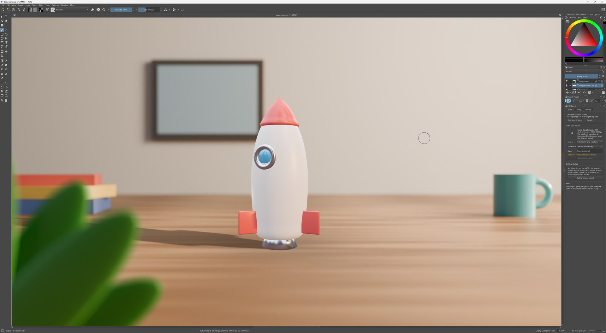

<p align="center">
  
</p>

<h1 align="center">Geekatplay 3D Layers for Krita</h1>

<p align="center">
  <b>Turn any Krita layer into a 3D model, then pose it and light it in your picture as a layer you can change at any time.</b><br>
  Works with Meshy, Tripo, Hitem3D (hi3d.ai) and your own ComfyUI. Free and open source.
</p>

---

## How it works

1. **Select a layer** in Krita, such as an object on a transparent background, and click **Generate 3D model**. A 3D service turns it into a real 3D model.
2. **Pose and light it in your scene.** The 3D editor opens in its own window and shows your image around the model: the layers below behind it, the layers above in front of it. Turn the model, pick a lighting preset, drag the sun, add shadows, and click **Place in Document**. The model lands in your image exactly where you saw it, as a normal paint layer.
3. **Change it later.** Select the layer and click **Edit pose & light**. Change the pose or the light, click **Update Layer**, and the layer updates in place, even after you save, close and reopen the `.kra`.

Every model is kept in a library on your computer, so you can use it again in any image without paying to generate it twice. **No account yet?** Click **Try the sample model** and start right away. **Have 3D files already?** Import GLB, FBX, OBJ, USDZ, STL and more.


## Install

You need **Krita 5.2 or newer** (Krita 6 works too) and Microsoft Edge or Google Chrome, which Windows already has.

1. **Download** `Geekatplay-3D-Layers-Krita-0.1.0.zip` from the [Releases page](https://github.com/GeekatplayStudio/Krita-3D-Layers/releases/latest).
2. **Close Krita.**
3. **Unzip** the download (right-click › *Extract All…* on Windows; double-click on a Mac) and run the installer for your computer:

   | Your computer | Do this |
   |---|---|
   | **Windows** | Double-click **Install on Windows.cmd**. If Windows shows a security warning about a downloaded file, choose *Run* (or *More info* › *Run anyway*). |
   | **Mac** | Double-click **Install on macOS.command**. If macOS says it can't check the file, right-click it, choose *Open*, then *Open*. |
   | **Linux** | In a terminal, in the unzipped folder: `sh "Install on Linux.sh"` |

4. **Open Krita**, open or create an image, and choose **Settings › Dockers › 3D Layers**. The panel appears on the right.

**Prefer Krita's own way?** In Krita: **Tools › Scripts › Import Python Plugin from File…**, pick the downloaded ZIP, answer **Yes** when it asks to enable the plugin, and restart Krita.

To remove it: double-click **Uninstall on Windows.cmd** (Mac/Linux: `sh install/install-unix.sh --uninstall`), or untick it in **Settings › Configure Krita › Python Plugin Manager**. Your models and keys are kept.

## Your first 3D layer

1. Open an image and show the **3D Layers** docker (**Settings › Dockers › 3D Layers**).
2. On the **Create** tab, click **Try the sample model**. The 3D editor opens in its own window, with your image around the model.
3. Turn the model, click a light preset such as **Golden Hour**, and click **Place in Document**. Close the editor window if it stays open.
4. To change it later, select the layer and click **Edit pose & light** in the docker.

**Make your own models:** on the docker's **Settings** tab, paste the API key of one service (see below) and click **Test connection**. Then select a layer, pick the service on the **Create** tab, and click **Generate 3D model**. When the job says **Ready**, click **Pose & place**.

The [user guide](docs/USER_GUIDE.md) explains every option.

<p align="center"></p>

## Choose a 3D service

You only need one. All of them return a textured model.

| Service | Cost | What you need | Get started |
|---|---|---|---|
| **Meshy** | Meshy credits (API access needs a paid plan) | An API key (`msy_…`) | [meshy.ai › API keys](https://www.meshy.ai/developers/keys) |
| **Tripo** | Tripo credits | An API key (`tsk_…`) | [platform.tripo3d.ai › API keys](https://platform.tripo3d.ai/api-keys) |
| **Hitem3D** (hi3d.ai) | Hitem3D credits | An Access Key and a Secret Key | [platform.hi3d.ai › API Keys](https://platform.hi3d.ai/console/apiKey) |
| **ComfyUI** | Free, runs on your own computer | ComfyUI with the TRELLIS.2 nodes and a strong graphics card | [Setup in the user guide](docs/USER_GUIDE.md#comfyui) |

Keys are stored only on your computer and sent only to the service they belong to.

## Works with the Photoshop plugin

If you also use [Geekatplay 3D Layers for Photoshop](https://github.com/GeekatplayStudio/Photoshop-3D), both plugins share **one model library and one set of API keys**: a model you made in Photoshop is in Krita's Library too, and a key you entered in one works in the other.

## Features

- **Send to 3D:** the active layer, or what is visible inside your selection (soft selection edges stay soft).
- **Jobs in the background:** keep painting while a model is made; jobs continue after a Krita restart.
- **3D pose & light editor:** shows your image around the model; seven light presets, a sun you drag, colour temperature, ten environments, cast and contact shadows, camera views and field of view; exports up to 8192 px.
- **Re-posable layers:** the pose and lighting are saved inside your `.kra`. Moving the layer with Krita's Move tool is fine: the next update follows it.
- **Library:** previews, folders, search, stars; import GLB, glTF, FBX, OBJ, DAE, USDZ, 3DS, STL, PLY, 3MF, AMF, VRML and VOX (drop files onto the Library, or use **Import**).
- **Any colour depth:** 8-bit, 16-bit and float images, in any RGB profile.

## Questions

**Why does the 3D editor open in a browser window?** Krita plugins can't show 3D graphics inside Krita, so the editor runs in Edge or Chrome as its own window, without tabs or an address bar. It's the same editor as in the Photoshop plugin. It talks only to Krita on your computer (through a private address that changes every time) and needs no internet connection.

**Where are my models?** In `%APPDATA%\Geekatplay\3D Layers\library` on Windows, `~/Library/Application Support/Geekatplay/3D Layers/library` on macOS, `~/.local/share/Geekatplay/3D Layers/library` on Linux. **Library › ⋯ › Show the library folder** opens it.

**Can I paint on a 3D layer?** Yes, it's a normal paint layer. But **Update Layer** replaces its pixels with the new render, so paint on a layer above it instead.

**Something went wrong.** **Settings › Files › Open log** shows what the plugin did. See [Troubleshooting](docs/USER_GUIDE.md#troubleshooting).

## Documentation

- [User guide](docs/USER_GUIDE.md): every option, services, the editor, the library, troubleshooting
- [Architecture](docs/ARCHITECTURE.md): how the plugin is built, and what we found out about Krita's scripting API
- [Development](docs/DEVELOPMENT.md) and [Testing](docs/TESTING.md)
- [Privacy](PRIVACY.md) · [Changelog](CHANGELOG.md) · [License (MIT)](LICENSE)

## For developers

The plugin is Python (Krita's scripting API, PyQt5/PyQt6) plus the Photoshop plugin's web 3D editor (React, three.js), which a small local server inside the plugin serves to a browser window.

```bash
npm install            # the web editor's tools
npm run build          # builds the editor into plugin/geekatplay_3d_layers/web
npm test               # Python tests (pytest)
python tests/krita/run.py   # document operations inside real Krita (headless)
npm run install:krita  # copies the plugin into Krita for trying it out
npm run dist           # the release ZIP in dist/
```

See [DEVELOPMENT.md](docs/DEVELOPMENT.md).

## Credits

Made by [Geekatplay Studio](https://www.geekatplay.com) (Vladimir Chopine). The 3D editor comes from Geekatplay **ImageExpress** by way of the Photoshop plugin. Lighting environments are CC0 HDRIs from Poly Haven (through `@pmndrs/assets`).
