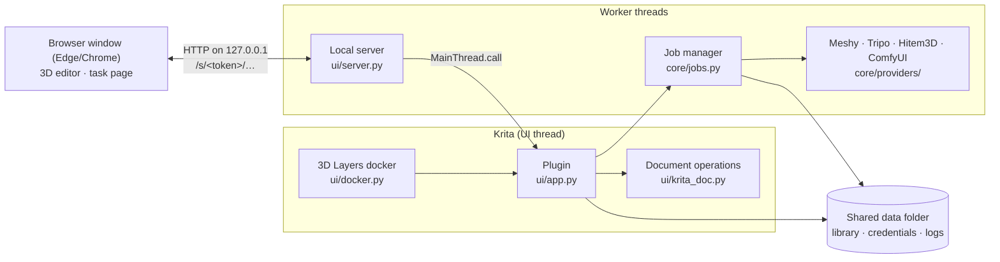

# Architecture

Geekatplay 3D Layers for Krita is a Krita Python plugin with a browser-based 3D editor. It is a sibling of [Geekatplay 3D Layers for Photoshop](https://github.com/GeekatplayStudio/Photoshop-3D): the service clients, job queue and library are Python ports of that plugin's TypeScript host, the 3D editor is the same web code, and both plugins share one data folder.

## Why a browser window

Krita's bundled PyQt has no QtWebEngine and no 3D view a plugin can use (PyQt5 5.15 in Krita 5.3.4 ships QtCore, QtGui, QtWidgets, QtNetwork, QtOpenGL, QtQuick, but no WebEngine or Qt 3D). Writing a glTF renderer with PBR materials, shadows and environment lighting in Python would be a project of its own, and slow. So the editor, the same React + three.js code as in the Photoshop plugin, runs in a Chromium "app" window (no tabs or address bar), served by the plugin. Edge is on every Windows 10/11 computer; Chrome, Brave or Chromium are used when present; otherwise the default browser.

## Layout

| Path | What |
|---|---|
| `plugin/geekatplay_3d_layers.desktop` | Tells Krita about the plugin |
| `plugin/geekatplay_3d_layers/__init__.py` | Registers the docker and the menu action (only inside Krita) |
| `…/core/` | No Krita or Qt: settings, HTTP, providers, library, jobs, importer, geometry. Tested with pytest. |
| `…/core/providers/` | One module per service (ports of the Photoshop plugin's `src/host/providers`), `registry.py` lists them |
| `…/ui/qt.py` | PyQt5/PyQt6 compatibility (scoped enums, `exec`, moved classes) |
| `…/ui/app.py` | The plugin object: services, timers, editor sessions, the calls from the browser |
| `…/ui/krita_doc.py` | Every Krita document operation |
| `…/ui/server.py` | The local HTTP server for the browser pages |
| `…/ui/browser.py` | Opens the page in an app window or the default browser |
| `…/ui/docker.py`, `extension.py` | The docker and Tools › Scripts › Edit 3D Layer |
| `…/web/` | The built editor and task page (from `web/`, built by `npm run build`) |
| `web/src/` | Web sources, copied from the Photoshop plugin by `scripts/sync-web.mjs`, plus the Krita-owned files listed there |
| `install/` | The installers in the release ZIP |
| `tests/` | pytest (`test_*.py`), the in-Krita integration test (`krita/`), the editor driver (`e2e/`) |

## Threads

- **Krita's UI thread** owns every Krita API call and every widget. A `QTimer` calls `JobManager.tick()` every second; job state changes only there, so the docker never sees half-updated jobs.
- **Job workers** (`ThreadPoolExecutor`, 4 threads) make the provider calls (`urllib`, synchronous) and the downloads. They return results; `tick()` applies them.
- **Server threads** (`ThreadingHTTPServer`) answer the browser. Calls that touch Krita are handed to the UI thread with `MainThread.call`, a Qt signal (queued across threads) plus an event the server thread waits on.

## Main flows

### Generate
1. `krita_doc.read_source`: the active layer via `Node.thumbnail(w, h)` at the layer's size (sRGB 8-bit in any colour space), or the selection via `Document.projection(x, y, w, h)` multiplied by the selection mask (`QPainter` *DestinationIn* with an `Alpha8` image). Scaled to *Max image size*, encoded as PNG.
2. `JobManager.start` saves `krita/jobs/<id>/source.png` and submits on a worker. Polling: every 2 s, backing off ×1.5 to 15 s; transient errors retried up to 6 times; a 429 waits as long as the service asks.
3. When the service is done, the same worker downloads the model at once (links are signed and expire) and adds it to the library (`import_model_result`).

### Place and re-pose
1. `Plugin.place_model` (or `edit_active_layer`) opens a **session**: a 24-byte random token, the editor's start data, and the target (document, the layer to split at, the 3D layer). The browser opens `http://127.0.0.1:<port>/s/<token>/editor.html`; every request carries the token in its path.
2. The page calls `editor.getInit`, loads the model from `./library/<file>`, and (with *Show document*) `editor.documentView`.
3. `krita_doc.document_view` splits the layer stack at the split layer (`core/geometry.split_layers`, the same rules as the Photoshop plugin), hides one part, reads `Document.projection`, puts the visibility back, and restores the document's *modified* flag.
4. **OK** sends the PNG, its size, the content bounds, the 3D settings and, with *Show document*, the frame: where the whole render goes in the document.
5. `place_render` creates a paint layer above the split layer and writes the render, scaled to the frame, with `setPixelData`; `update_render` clears the layer and writes the new render in the same place. The 3D state goes into the document annotation `geekatplay-3d-layers`: `{"version": 1, "layers": {<layer uuid>: {libraryId, modelName, origin, remoteId, settings, frame, renderWidth, content, updatedAt}}}`.
6. Re-posing finds the layer's current frame from its bounds (`current_frame`): if the layer was moved (same size) or scaled evenly (same proportions), the stored frame is moved or scaled the same way.

### Import
`ModelImporter` stores GLB (and self-contained glTF) directly. Other formats get an import id and URLs (`./import-file/<id>/<n>`) for the model and the material/texture files next to it; the task page converts them with three.js (the Photoshop plugin's `convert.ts`) and sends back a GLB (`library.addConverted`). Then it renders previews for models without one (`library.saveThumbnail`).

## Shared data with the Photoshop plugin

The data folder (`%APPDATA%\Geekatplay\3D Layers` and the macOS/Linux equivalents) holds `library/` and `credentials.json` in the Photoshop plugin's exact formats; Krita's own files are in `krita/` and `logs/krita3d.log`. The Krita library re-reads `index.json` before every change when its modification time changed, and every 2.5 s refreshes the docker if the other plugin added something.

## Security

- The server binds `127.0.0.1` on a random port and answers only for tokens of open sessions; a request with another `Host` header (DNS rebinding) is refused. Paths are resolved and must stay inside the web or library folder; import files are served only for imports in progress.
- Keys never go to the browser pages, the log (see `core/log.redact`) or `settings.json`.

## Platform findings

Verified in Krita 5.3.4 (Python 3.13.5, PyQt5 5.15.11) on Windows 11 with `kritarunner` (`tests/krita/`) and by hand.

| Finding | Consequence in the code |
|---|---|
| `Node.thumbnail(w, h)` maps the node's **exact bounds** to `w`×`h` and returns an ARGB32 `QImage` converted to sRGB, whatever the image's colour space. | `read_source` reads a layer at its own size with it. |
| `Document.thumbnail(w, h)` returns **RGB32 without alpha** (transparent pixels turn black) and can return stale content after visibility changes. `Document.projection(x, y, w, h)` returns correct ARGB32. | `document_view` and the selection source use `projection`. |
| `Node.setPixelData` needs bytes in the node's colour space; for RGBA U8 that is BGRA, the same memory layout as `QImage.Format_ARGB32` on little-endian machines. Pixels may be written at negative coordinates (layers are unbounded). | `_write` converts the layer to RGBA/U8/sRGB with `Node.setColorSpace`, writes, and converts back, so 16-bit and float images work. |
| `Document.setAnnotation` data is saved in the `.kra` and survives reopening; node `uniqueId()`s are stable across save and load. | 3D layer state is an annotation keyed by layer uuid. |
| Krita lists `childNodes()` **bottom first**. A selection adds a top-level `selectionmask` node. | The split reverses the list and leaves masks out. |
| `Node.setVisible` + `Document.refreshProjection()` + `waitForDone()` update the projection before the call returns. | "Show document" hides one part, reads, and shows it again right away; the *modified* flag is restored. |
| Headless (`kritarunner`) Krita has no view, so `activeDocument()` and `activeNode()` are `None`. | `krita_doc.active_doc` / `active_node` are single functions the integration test replaces. |
| `kritarunner -s <module>` imports the script from the **working directory**. | `tests/krita/run.py` copies the script to a temp folder and runs from there. |
| Krita writes `kritarc` when it closes, so editing it while Krita runs is lost. The plugin switch is `enable_<module>=true` in section `[python]`. | The installers wait until Krita is closed. |
| Krita's importer (`plugin_importer`) takes only the `.desktop` files and their module folders from a ZIP. | The release ZIP carries the installers too, and still imports cleanly. |
| A Krita plugin cannot take over double-clicking a layer. | Re-posing is a docker button and a menu action that accepts a keyboard shortcut. |

## Adding a 3D service

1. `core/providers/<name>.py` implementing `Provider` (`is_configured`, `test`, `submit`, `poll`, `resolve`, optionally `cancel`); `meshy.py` is a complete example.
2. Add it to `registry.py`, its id to `PROVIDER_IDS`/`PROVIDER_LABELS` in `base.py`, its settings to `core/settings.py`, its keys to `SECRET_KEYS`, and a group to `SettingsTab` in `ui/docker.py`.
3. Tests next to the others, with `tests/helpers.ScriptedTransport`.
