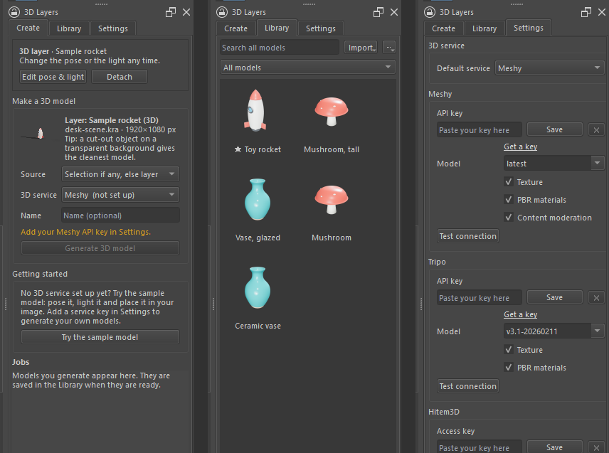
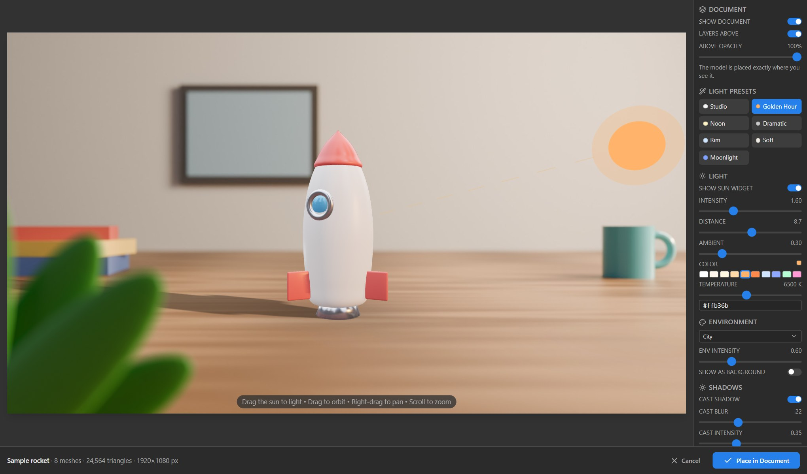

# User guide

Geekatplay 3D Layers for Krita, version 0.1.

- [1. Install](#1-install)
- [2. The docker](#2-the-docker)
- [3. Set up a 3D service](#3-set-up-a-3d-service)
- [4. Make a 3D model from a layer](#4-make-a-3d-model-from-a-layer)
- [5. The 3D editor](#5-the-3d-editor)
- [6. Re-pose a 3D layer later](#6-re-pose-a-3d-layer-later)
- [7. The library](#7-the-library)
- [8. Settings](#8-settings)
- [9. Files the plugin uses](#9-files-the-plugin-uses)
- [Troubleshooting](#troubleshooting)

## 1. Install

See [Install in the README](../README.md#install). In short: close Krita, unzip the download, double-click **Install on Windows.cmd** (or **Install on macOS.command**), open Krita, and choose **Settings › Dockers › 3D Layers**.

The installer copies the plugin into Krita's plugin folder (`pykrita`) and switches it on in Krita's settings. Krita must be closed while it runs, because Krita rewrites its settings when it closes. The installer waits for you to close it.

Krita's own **Tools › Scripts › Import Python Plugin from File…** works with the same ZIP; after it, restart Krita.

**Requirements:** Krita 5.2 or newer (tested in Krita 5.3.4; the code also supports Krita 6 and its PyQt6), Windows 10/11, macOS or Linux, and a Chromium browser (Microsoft Edge, Google Chrome, Brave or Chromium) for the editor window. Without one, the editor opens in your default browser.

## 2. The docker

**Settings › Dockers › 3D Layers** shows it. Like any docker you can move it, make it float, or put it in a tab group. It has three tabs:

| Tab | What it's for |
|---|---|
| **Create** | Send the active layer or selection to a 3D service; follow the jobs; **Pose & place** a finished model. When the active layer is a 3D layer, a banner offers **Edit pose & light** and **Detach**. |
| **Library** | Every model on this computer, with previews. Double-click one to place it. |
| **Settings** | Keys and options for each service, the editor, and the files the plugin uses. |

A blue line at the top shows what just happened ("Sent “Chair” to Meshy", "Placed Rocket (3D)"); a red one shows a problem.

## 3. Set up a 3D service

You need one service to generate models. Placing, posing and the library work without any.

### Meshy
1. Sign in at [meshy.ai](https://www.meshy.ai) and open [API keys](https://www.meshy.ai/developers/keys). API access needs a paid plan.
2. Create a key (it starts with `msy_`), paste it into **Settings › Meshy › API key**, click **Save**.
3. Click **Test connection**: it shows your credit balance.

Options: **Model** (`latest` follows Meshy's newest; `meshy-t2` is Smart Topology, clean low-poly), **Texture**, **PBR materials**, **Content moderation** (Meshy checks the image before generating; on by default).

### Tripo
Create a key at [platform.tripo3d.ai](https://platform.tripo3d.ai/api-keys) (it starts with `tsk_`), paste it into **Settings › Tripo › API key**, **Save**, **Test connection**. Options: **Model** (v3.1 is the newest; P1/P2 make low-poly models), **Texture**, **PBR materials**.

### Hitem3D
Create an Access Key and a Secret Key at [platform.hi3d.ai](https://platform.hi3d.ai/console/apiKey), paste both, **Save**, **Test connection**. Options: **Model**, **Resolution** (the choices depend on the model), **Face count** (0 = Hitem3D's default), **PBR materials**.

### ComfyUI
ComfyUI runs on your own computer (or another one on your network) and is free. The built-in workflow uses **TRELLIS.2**:

1. Install [ComfyUI](https://www.comfy.org) and the TRELLIS.2 nodes, and download the TRELLIS.2 models (the same setup as the Photoshop plugin's; its [ComfyUI section](https://github.com/GeekatplayStudio/Photoshop-3D/blob/main/docs/USER_GUIDE.md#comfyui-local-or-on-your-network) has the details).
2. Start ComfyUI. In **Settings › ComfyUI**, the **Address** is `http://127.0.0.1:8188` for ComfyUI on this computer.
3. **Test connection** shows ComfyUI's version and graphics card, and lists any TRELLIS.2 node or model that is missing.

**Load a workflow…** uses your own image-to-3D workflow instead: in ComfyUI use **Workflow › Export (API)** and load that file. The plugin puts the layer into its **Load Image** node (one titled "Krita", "Photoshop", "input" or "source" if there are several) and takes the first `.glb` it saves.

A model takes about five minutes on a fast graphics card (RTX 3090).

## 4. Make a 3D model from a layer

1. Select the layer. The best results come from **one object on a transparent background**: cut it out first.
2. On the **Create** tab, choose the **Source**:
   - **Selection if any, else layer** (default): what is visible inside your selection, or the active layer when nothing is selected;
   - **Active layer**: the layer's own pixels;
   - **Selection**: what is visible inside the selection (soft edges stay soft).
3. Choose the **3D service**, type a **Name** if you like, and click **Generate 3D model**.
4. The job appears below with its progress. You can keep working, close the docker, or even restart Krita: the job continues.
5. When it says **Ready**, the model is already in your library. Click **Pose & place**.

Large layers are scaled down before they are sent (**Settings › Generation › Max image size**, 2048 px by default), because the services have size limits.

If a job fails, the reason is shown in red. **Retry** sends it again (or downloads it again, if the service had finished). **Cancel** stops a running job; Meshy and ComfyUI also stop it on their side.

## 5. The 3D editor

The editor opens in its own window (Edge or Chrome without tabs) and shows the model over your image.

| Area | Controls |
|---|---|
| Viewport | Drag to orbit, right-drag to pan, scroll to zoom. Drag the **sun** to set the light direction. The viewport has the export's shape, so what you frame is what you get. |
| Document | **Show document** (layers below behind the model, layers above in front), **Layers above** on/off, **Above opacity** |
| Light presets | Studio, Golden Hour, Noon, Dramatic, Rim, Soft, Moonlight |
| Light | Sun widget on/off, intensity, distance, ambient, colour (swatches, temperature, hex) |
| Environment | Ten lighting environments; intensity; *show as background* (otherwise the background is transparent) |
| Shadows | Cast shadow and contact shadow, each with blur and intensity |
| Pose | Turn, tilt, roll, scale; reset |
| Camera | Front, ¾ left, ¾ right, side, top, reset; field of view |
| Export resolution | Width and height up to 8192 px, presets, **Match document** |

**Place in Document** renders the model and puts it in your image as a new paint layer named `<model> (3D)`, **above the layer that was selected**. With **Show document** on, it lands exactly where you saw it; **Match document** renders it at the image's own size, pixel for pixel. With **Show document** off, the model is fitted into the area you sent it from (or the middle of the image).

**Cancel**, or closing the window, changes nothing. The docker shows "3D editor open" while the editor is open; **Stop** there ends the session from Krita's side.

Lighting you set for a new model is remembered for the next one (**Settings › 3D editor**).

## 6. Re-pose a 3D layer later

Select the 3D layer: the **Create** tab shows a banner. Click **Edit pose & light** (or use **Tools › Scripts › Edit 3D Layer (Pose & Light)…**, which you can give a keyboard shortcut in **Settings › Configure Krita › Keyboard Shortcuts**). Change anything and click **Update Layer**.

- The layer keeps its place, also after you moved it with the **Move** tool. If you scaled it evenly with the **Transform** tool, the update follows that too.
- Its pose, light, camera and size are saved inside the `.kra` (as a document annotation), so this works after closing and reopening the file.
- **Update Layer** replaces the layer's pixels. Paint on a layer above it if you want to keep your paint.
- **Detach** removes the 3D data: the layer stays as an ordinary paint layer.
- A duplicated 3D layer is an ordinary copy; only the original can be re-posed.
- On a computer that doesn't have the model, re-posing asks you to import its GLB into the library first.

## 7. The library

The **Library** tab shows every model, newest first, starred ones at the top. Double-click a model to place it in the image. Right-click for **Place in the image**, **Rename**, **Star**, **Show the file**, **Move to folder** and **Remove from the library**. Select several with Ctrl/Shift-click to move or remove them together.

- **Folders:** the list above the models chooses **All models**, the top level, or a folder (its subfolders included). **⋯ › New folder / Rename this folder / Delete this folder**. Deleting a folder moves its models up a level; it never deletes models.
- **Search** looks in every folder.
- **Import:** **Import › Import files…** or **Import a folder…** (a folder becomes a library folder with its subfolders), or drop 3D files and folders onto the models. GLB files are added at once; other formats (FBX, OBJ with its .mtl and textures, DAE, USDZ, 3DS, STL, PLY, 3MF, AMF, VRML, VOX) are converted to GLB in a small browser window that closes itself.
- **⋯ › Make missing previews** renders previews for models that have none (in a browser window too).
- **Remove** deletes the model's files. Layers you already placed keep their pixels.

The library is shared with the Photoshop plugin: models made there appear here (the list refreshes by itself), and the other way round.

## 8. Settings

| Group | Setting |
|---|---|
| 3D service | The service the Create tab starts with |
| Meshy, Tripo, Hitem3D, ComfyUI | Keys or address, model and options, **Test connection** |
| Generation | **Max image size**: the longest side of the image sent to a service |
| 3D editor | **Export size** for new models; **Remember lighting**; **Open the editor in** its own window (Edge or Chrome) or a browser tab |
| Files | **Show data folder**, **Open log** |

Keys are saved in `credentials.json` in the data folder, readable only by your user account on macOS and Linux. A saved key shows only as `msy_…1234`. **✕** removes it.

## 9. Files the plugin uses

| What | Where |
|---|---|
| The plugin | Krita's `pykrita` folder: `%APPDATA%\krita\pykrita` (Windows), `~/Library/Application Support/krita/pykrita` (macOS), `~/.local/share/krita/pykrita` (Linux) |
| Data folder (shared with the Photoshop plugin) | `%APPDATA%\Geekatplay\3D Layers`, `~/Library/Application Support/Geekatplay/3D Layers`, `~/.local/share/Geekatplay/3D Layers` |
| Model library | `library/` in the data folder (`index.json` plus one folder per model) |
| API keys | `credentials.json` in the data folder |
| Krita's settings and jobs | `krita/settings.json`, `krita/jobs.json` in the data folder |
| Log | `logs/krita3d.log` in the data folder (keys are never written to it) |
| 3D layer data | Inside each `.kra`, as the annotation `geekatplay-3d-layers` |

## Troubleshooting

| Problem | What to do |
|---|---|
| No **3D Layers** in Settings › Dockers | Check **Settings › Configure Krita › Python Plugin Manager**: *Geekatplay 3D Layers* must be ticked; restart Krita after ticking it. If it is greyed out, hover it to see why, and send us the log. |
| The editor window doesn't open | Settings › 3D editor › **Open the editor in: A browser tab**. If nothing opens at all, see the log: it says which browser was tried. |
| "This 3D editor session has ended" in the editor | The docker's **Stop** was clicked, or another model was opened. Open the model again from Krita. |
| The editor shows "Krita is not reachable" | Krita was closed or the plugin restarted. Open the model again from Krita. |
| A job fails with "cannot reach" | Check your internet connection; for ComfyUI, that ComfyUI is running and the address in Settings is right. |
| A service says the key is wrong | Paste the key again in Settings and **Test connection**. |
| Re-posing says the model is not in the library | The `.kra` came from another computer: import the model's GLB on the Library tab, then try again. |
| "This 3D layer is no longer a paint layer" | The layer was converted (for example into a group or a vector layer). Place the model again. |

**Settings › Files › Open log** shows everything the plugin did. Please include it when you report a problem.
